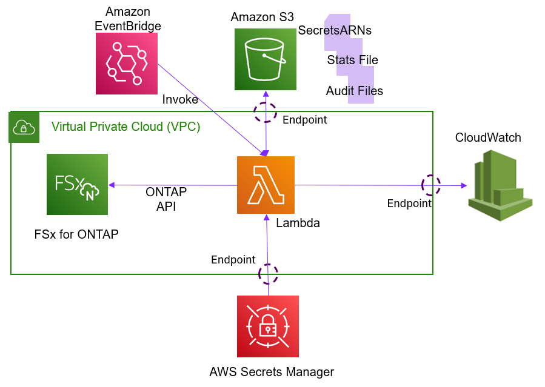

# Ingest FSx for ONTAP NAS audit logs into CloudWatch

## Overview
This sample demonstrates a way to ingest the NAS audit logs from an FSx for Data ONTAP file system into a CloudWatch log group
without having to NFS or CIFS mount a volume to access them. It will attempt to gather the audit logs from all the SVMs within
all the FSx for Data ONTAP file systems that are within a specified region. It will skip any file systems where credentials
haven't been provided for or SVMs that do not have the appropriate NAS auditing configuration enabled.

### Maintaining State
The program maintains a "stats" file in an S3 bucket that allows it to keep track of the last time it successfully ingested audit logs
from each SVM to ensure it doesn't process an audit file more than once.

### Providing Credentials
There are several ways to provide the Secrets Manager secret ARNs for the file systems you want to ingest
audit logs from:
1. You can create a file that has a line for each file system. The format should be:
    ```
    FileSystemID1 = SecretARN
    FileSystemID2 = SecretARN
    ```
    For example:
    ```
    fs-00000000000000000=arn:aws:secretsmanager:us-west-2:000000000000:secret:secret_name1-XXXXXX
    fs-11111111111111111=arn:aws:secretsmanager:us-west-2:000000000000:secret:secret_name2-XXXXXX
    ```
    Once the file has been created, upload it to the S3 bucket and provide the filename as the
    value for the `fsxnSecretsARNsfile` parameter during the CloudFormation deployment, or via an
    environment variable with the same naem.
2. If all, or most, of your file systems use the same credentials you can set a default secret ARN that will
    be used if a secret ARN hasn't been provide for a sepcific file system ID. Please use this
    method with caution since if the program encouters a file system that doesn't have the
    correct credentials it could lock the acount by using the wrong password too many times in a row.
3. You can pass the secret ARNs via environment variables. The program supports up to 5 file systems
    using this method. The environment variables should be set in pairs where one defines the file system
    ID and the other defines the associated secret. Here is the list of environment variables:
    `fileSystem1ID`/`fileSystem1SecretARN`, `fileSystem2ID`/`fileSystem2SecretARN`, `fileSystem3ID`/`fileSystem3SecretARN`,
    `fileSystem4ID`/`fileSystem4SecretARN`, `fileSystem5ID`/`fileSystem5SecretARN`
4. Edit the variable assignments at the top program. There are instructions in the code that explain how to do this.

**NOTE:** If you provide the `secretsARNsfile` parameter, and that file exists in the S3 bucket, the program
will ignore any environment variables that have been set for file system IDs and secret ARNs. Furthermore,
if the file doesn't exist, but the environment variables have been set, the program will create the file in
the S3 bucket with the contents of the environment variables. This allows you to use the environment variables
to create the file in S3, and then use that file for subsequent runs of the program.

### Methods of installation
There are two ways to install this program. Either with the [CloudFormation script](cloudformation-template.yaml) found in this repo,
or by following instructions found in this file.

## Architecture
This solution is made up of a Lambda function that is triggered by an EventBridge schedule. Once invoked
the Lambda function will use AWS APIs to gather the list of all the FSx for ONTAP file systems in the
specified region. It will then use the credentials provided in specified AWS Secrets Manager secret to
issue ONTAP API calls to list all the volumes in the file system, across all the SVMs, that have the name
specified in the `VolumeName` parameter. From each one of the volumes it will gather the list of all
the audit log files and ingest any that haven't been processed before into a CloudWatch Log Group Log
Stream. The name of the Log Stream will equal to the name of the audit log file. It can optionally
copy the raw audit file into the S3 bucket as well. The Lambda function will update the "stats" file
in the S3 bucket to keep track of the last time it successfully ingested audit logs from each SVM.

Note that since the Lambda function has to be able to communicate with the FSx for ONTAP
file system, it must run within a VPC subnet that has connectivity to the FSx for ONTAP management endpoint.



## Prerequisites
- An FSx for Data ONTAP file system.
- Have NAS auditing configured and enabled on the SVM within a FSx for Data ONTAP file system. **Ensure you have selected the XML format for the audit logs.** Also,
ensure you have set up a rotation schedule. The program will only act on audit log files that have been finalized, and not the "active" one. You can read this
[knowledge based article](https://kb.netapp.com/on-prem/ontap/da/NAS/NAS-KBs/How_to_set_up_NAS_auditing_in_ONTAP_9) for instructions on how to setup NAS auditing.
- Have the NAS auditing configured to store the audit logs in a volume with the same name in all SVMs on all the FSx for Data ONTAP file
systems that you want to ingest the audit logs from.
- You have applied the necessary SACLs to the files you want to audit. The knowledge base article linked above provides guidance on how to do this.
    **NOTE:** If you need to apply SACLs to all the files in a volume, you should consider using the 'SLAG' (Storage-Level Access Guard) feature of ONTAP
    which allows you to enforce SACLs on all the files in a volume without having to apply them to all the individual files. You can read about SLAG in the
    NetApp documentation [here](https://docs.netapp.com/us-en/ontap/smb-admin/secure-file-access-storage-level-access-guard-concept.html).
- An S3 bucket to store the "stats" file and optionally a copy of all the raw NAS audit log files. It will also
hold a Lambda layer file needed to be able to an add Lambda Layer from a CloudFormation script.
    - You will need to download the [Lambda layer zip file](https://raw.githubusercontent.com/NetApp/FSx-ONTAP-monitoring/main/FSx-Audit-Logs-CloudWatch/lambda_layer.zip)
    from this repo and upload it to the S3 bucket. Be sure to preserve the name `lambda_layer.zip`.
    - The "stats" file is maintained by the program. It is used to keep track of the last time the Lambda function successfully
    ingested audit logs from each SVM. Its size will be small (i.e. less than a few megabytes).
- A CloudWatch log group to ingest the audit logs into. Each audit log file will get its own log stream within the log group.
- An AWS Secrets Manager secret for each of the FSxN file systems you wish to ingest the audit logs from. The secret should have two keys `username` and `password`. For example:
    ```json
      {
        "username": "fsxadmin",
        "password": "superSecretPassword"
      }
    ```
    - If you use want to use the same credentials for all the FSx for ONTAP file systems, then you can specify a
    default secret ARN with the `defaultSecretARN` parameter. Caution should be given when using this method since if the
    program encounters a file system that has different credentials for the account sepcified it will fail to login.
    After 3 failed attempts ONTAP will lock the account. If the account is 'fsxadmin' it should get unlucked
    automatically after 45 minutes after the last failed attempt.

- Create a role that will allow the Lambda function to preform the needed function. Here are the required permissions:

<!--- Using HTML to create a table that has rowspan attributes since the markdown table syntax does not support that. --->
<table>
<tr><th>Service</td><th>Actions</td><th>Resources</th></tr>
<tr><td>Fsx</td><td>fsx:DescribeFileSystems</td><td>&#42;</td></tr>
<tr><td rowspan="6">ec2</td><td>DescribeNetworkInterfaces</td><td rowspan="6">&#42;</td></tr>
<tr><td>CreateNetworkInterface</td></tr>
<tr><td>DeleteNetworkInterface</td></tr>
<tr><td>DescribeSubnets</td></tr>
<tr><td>AssignPrivateIpAddresses</td></tr>
<tr><td>UnassignPrivateIpAddresses</td></tr>
<tr><td rowspan="3">logs</td><td rowspan="3">CreateLogGroup</td><td>&#42;</td></tr>
<tr><td>CreatLogStream</td></tr>
<tr><td>PutLogEvents</td></tr>
<tr><td rowspan="3">s3</td><td> ListBucket</td><td> arn:aws:s3:&lt;region&gt;:&lt;accountID&gt;:&#42;</td></tr>
<tr><td>GetObject</td><td rowspan="2">arn:aws:s3:&lt;region>:&lt;accountID&gt;:&#42;/&#42;</td></tr>
<tr><td>PutObject</td></tr>
<tr><td>Secrets Manager</td><td> GetSecretValue </td><td>arn:aws:secretsmanager:&lt;region&gt;:&lt;accountID&gt;:secret:&lt;secretNames&gt&#42;</td></tr>
</table>
Where:

- &lt;accountID&gt; -  is your AWS account ID.
- &lt;region&gt; - is the region where the FSx for ONTAP file systems are located.
- &lt;secretNames&gt; - is the common prefix that all the secrets have that contain the credentials for
the file systems you want to ingest logs from. This there isn't a common prefix then you must
list each secret ARN individually. Or, you could use `*` as the resource and have a condition that limits
the scope of the screts it can access.

Notes:
- The reason for the ec2 actions is because the Lambda function runs within your VPC and therefore needs to
    be able to create and delete a network interface, as well as assign an IP address to it. The actions are
    actually done by AWS Lambda service and not the Lambda function itself. Therefore, you want to restrict
    those permissions to only the AWS Lambda service then following the instructions found
    [here](https://docs.aws.amazon.com/lambda/latest/dg/configuration-vpc.html#configuration-vpc-best-practice).
- The reason for the `*` for the resource for the CloudWatch logs actions is so it can create a LogGroup for
    the diagnostic output of the Lambda function itself, as well as create LogStreams and PutEvents for the
    ingestion of the NAS audit logs. If required, you could restrict to just the LogGroup to be used for the
    audit logs and forgo the diagnostic output of the Lambda function itself. It's not necessary, but useful
    if something goes wrong.
- Since the ARN of any Secrets Manager secret has random characters at the end of it, you must add the
    `*` at the end, or provide the full ARN of the secret.

## Deployment
1. Create a Lambda deployment package by:
    1. Downloading the [ingest_nas_audit_logs.py](ingest_nas_audit_logs.py) file from this repository and placing it in an empty directory.
    1. Rename the file to `lambda_function.py`.
    1. Install a couple dependencies that aren't included with AWS's base Lambda runtime by executing the following command:<br>
`pip install --target . xmltodict requests_toolbelt`<br>
    1. Zip the contents of the directory into a zip file.<br>
`zip -r ingest_nas_audit_logs.zip .`<br>

2. Within the AWS console, or using the AWS API, create a Lambda function with:
    1. Python 3.11, or higher, as the runtime.
    1. Set the permissions to the role created above.
    1. Under `Additional Configurations` select `Enable VPC` and select a VPC and Subnet that will have access to all the FSx for ONTAP
file system management endpoints that you want to gather audit logs from. Also, select a Security Group that allows TCP port 443 outbound.
Inbound rules don't matter since the Lambda function is not accessible from a network.
    1. Click `Create Function` and on the next page, under the `Code` tab, select `Upload From -> .zip file.` Provide the .zip file created by the steps above. 
    1. From the `Configuration -> General` tab set the timeout to at least 30 seconds. You will may need to increase that if it has to
process a lot of audit entries and/or process a lot of SVMs.

3. Configure the Lambda function by setting the following environment variables. For a Lambda function you do this by clicking on the `Configuration` tab and then the `Environment variables` sub tab.

    | Variable | Required| Description |
    | --- | --- | --- |
    | fsxRegion | Yes |The region where the FSx for ONTAP file systems are located. |
    | volumeName | Yes| The name of the volume, on all the FSx for ONTAP file systems, where the audit logs are stored. |
    | logGroupName | Yes| The name of the CloudWatch log group to ingest the audit logs into. |
    | s3BucketName | Yes |The name of the S3 bucket where the stats file is stored. |
    | s3BucketRegion |Yes | The region of the S3 bucket where the stats file is stored. |
    | copyToS3 | No| Set to `true` if you want to copy the raw audit log files to the S3 bucket.|
    | preserveOldEvents|No|Since CloudWatch will reject any event that is more than 14 days old, if you set this parameter to 'true' the program will set the CloudWatch event timestamp to 13 days from the time the event is inserted into CloudWatch LogStream if the audit event is older than 13 days. Note that this will not affect the timestamp recorded in the event message itself, just the CloudWatch event timestamp.|
    | maxRunTime | No | The maximum amount of time, in seconds, that the program should run before exiting. This is mostly used when running the program as a Lambda function to avoid it being abruptly stopped because of a Lambda timeout.|
    |fsxnSecretARNsFile|No|The name of a file within the S3 bucket that contains the Secret ARNs for each for the FSxN file systems. The format of the file should be just `<fsID>=<secretARN>`. For example: `fs-0e8d9172fa5411111=arn:aws:secretsmanager:us-east-1:123456789012:secret:fsxadmin-abc123`|
    |defaultSecretARN|No|The ARN of an AWS Secrets Manager Secret to be used if a particular FSxN file system doesn't have a specific secret associated with it. Use with caution, since it will cause the program to try the credentials in the default secret for all FSxN where there isn't a secret specified for it which could cause an account to be locked out if the credentials are incorrect for that FSxN.|
    |fileSystem1ID|No|The ID of the first FSxN file system to ingest the audit logs from.|
    |fileSystem1SecretARN|No|The ARN of the secret that contains the credentials for the first FSx for Data ONTAP file system.|
    |fileSystem2ID|No|The ID of the second FSx for Data ONTAP file system to ingest the audit logs from.|
    |fileSystem2SecretARN|No|The ARN of the secret that contains the credentials for the second FSx for Data ONTAP file system.|
    |fileSystem3ID|No|The ID of the third FSx for Data ONTAP file system to ingest the audit logs from.|
    |fileSystem3SecretARN|No|The ARN of the secret that contains the credentials for the third FSx for Data ONTAP file system.|
    |fileSystem4ID|No|The ID of the forth FSx for Data ONTAP file system to ingest the audit logs from.|
    |fileSystem4SecretARN|No|The ARN of the secret that contains the credentials for the forth FSx for Data ONTAP file system.|
    |fileSystem5ID|No|The ID of the fifth FSx for Data ONTAP file system to ingest the audit logs from.|
    |fileSystem5SecretARN|No|The ARN of the secret that contains the credentials for the fifth FSx for Data ONTAP file system.|
    | statsName | Yes| The name you want to use as the stats file. |

    **NOTES:**
    - You need to set the `fsxnSecretARNsFile`, `defaultSecretARN` or the `fileSystemXID` and `fileSystemXSecretARN` variables otherwise, the program will not know how to access the FSxN file systems.
    - If `fsxnSecretARNsFile` is provided and the file it references exist in the S3 bucket, the program will ignore the `fileSystemXID` and `fileSystemXSecretARN` variables. If it is set and the file it references does not exist, the program will create one based on the values of the fileSystemXID/fileSystemXServerARN variables.

4. Test the Lambda function by clicking on the `Test` tab and then clicking on the `Test` button. You should see "Executing function: succeeded".
If not, click on the "Details" button to see what errors there are. Resolve the issues and click on the Test button again.
If you are unable to resolve an error please create an [issue](https://github.com/NetApp/FSx-ONTAP-monitoring/issues) on the GitHub repository and someone will help you.

5. After you have tested that the Lambda function is running correctly, add an EventBridge trigger to have it run periodically.
You can do this by clicking on the `Add Trigger` button within the AWS console on the Lambda page and selecting `EventBridge (CloudWatch Events)`
from the drop-down menu. You can then configure the schedule to run as often as you want. How often depends on how often you have
set up your FSx for ONTAP file systems to rotate audit logs, and how up-to-date you want the CloudWatch logs to be.

6. It is recommended that you create a CloudWatch alarm to monitor the Lambda function so you'll know if it has failed to run properly.
    1. Create an SNS topic by going to the Simple Notification Service (SNS) service in the AWS console and clicking on the
    `Topics` link in the left hand navigation pane. Click on the `Create topic` button. Create a `Standard` topic and give
    it a name and click on the `Create topic` button.
    1. Click on the topic you just created and click on `Create subscription`. Select `Email` as the protocol and provide an email
    address to send notifications to. You will need to confirm the subscription by clicking on a link in the email that is sent to you.
    2. Next, go to the CloudWatch service in the AWS console and click on the `Alarms` link in the left hand navigation
    pane and click on the `Create alarm` button.
    4. Click on the `Select metric` button. This will bring you to a page where you can provide the Lambda
    function name created in the steps above. Once you provide the name and hit `Return` it should present
    two boxes: "Lambda > By Resources" and "Lambda > By Function Name".
    5. Click on the "Lambda > By Function Name" box. This will bring you to a page where you can select
    the metric you want to monitor. In this case, you want to monitor the "Errors" metric so click on the
    box in front of the line with "Errors" as the metric name.
    6. Click on the "Select metric" button. This will bring you to a page where you can set the conditions for
    the alarm. The `Threshold Type` should be set to `Static` and the `Whenever Errors is...` set be set
    to `Greater`. Under the `than..` label put `0.5` in the text box. This will set the alarm to
    trigger if there are any errors.
    7. Click on `Next`.
    8. Insert the name of the SNS topic you created above into the `Send a notification to...` text box and click on `Next`.
   10. Give the Alarm a name and optionally a description and click on `Next`.
   11. Click on `Create alarm` to create the alarm.


## Author Information

This repository is maintained by the contributors listed on [GitHub](https://github.com/NetApp/FSx-ONTAP-monitoring/graphs/contributors).

## License

Licensed under the Apache License, Version 2.0 (the "License").

You may obtain a copy of the License at [apache.org/licenses/LICENSE-2.0](http://www.apache.org/licenses/LICENSE-2.0).

Unless required by applicable law or agreed to in writing, software distributed under the License is distributed on an _"AS IS"_ basis, without WARRANTIES or conditions of any kind, either express or implied.

See the License for the specific language governing permissions and limitations under the License.

© 2025 NetApp, Inc. All Rights Reserved.
