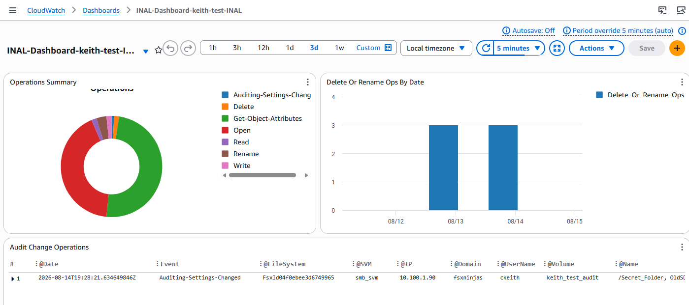

# Ingest FSx for ONTAP NAS audit logs into CloudWatch

## Overview
This sample demonstrates a way to ingest the NAS audit logs from an FSx for Data ONTAP file system into a CloudWatch log group
without having to NFS or CIFS mount a volume to access them. It will attempt to gather the audit logs from all the SVMs within
all the FSx for Data ONTAP file systems that are within a specified region. It will skip any file systems where credentials
haven't been provided for or SVMs that do not have the appropriate NAS auditing configuration enabled.

### Maintaining State
The program maintains a "stats" file in an S3 bucket that allows it to keep track of the last time it successfully ingested audit logs
from each SVM to ensure it doesn't process an audit file more than once.

### Providing Credentials
There are several ways to provide the Secrets Manager secret ARNs for the file systems you want to ingest
audit logs from:
1. You can create a file that has a line for each file system. The format should be:
    ```
    FileSystemID1 = SecretARN
    FileSystemID2 = SecretARN
    ```
    For example:
    ```
    fs-00000000000000000=arn:aws:secretsmanager:us-west-2:000000000000:secret:secret_name1-XXXXXX
    fs-11111111111111111=arn:aws:secretsmanager:us-west-2:000000000000:secret:secret_name2-XXXXXX
    ```
    Once the file has been created, upload it to the S3 bucket and provide the filename as the
    value for the `fsxnSecretsARNsfile` parameter during the CloudFormation deployment, or via an
    environment variable with the same naem.
2. If all, or most, of your file systems use the same credentials you can set a default secret ARN that will
    be used if a secret ARN hasn't been provide for a sepcific file system ID. Please use this
    method with caution since if the program encouters a file system that doesn't have the
    correct credentials it could lock the acount by using the wrong password too many times in a row.
3. You can pass the secret ARNs via environment variables. The program supports up to 5 file systems
    using this method. The environment variables should be set in pairs where one defines the file system
    ID and the other defines the associated secret. Here is the list of environment variables:
    `fileSystem1ID`/`fileSystem1SecretARN`, `fileSystem2ID`/`fileSystem2SecretARN`, `fileSystem3ID`/`fileSystem3SecretARN`,
    `fileSystem4ID`/`fileSystem4SecretARN`, `fileSystem5ID`/`fileSystem5SecretARN`
4. Edit the variable assignments at the top program. There are instructions in the code that explain how to do this.

**NOTE:** If you provide the `secretsARNsfile` parameter, and that file exists in the S3 bucket, the program
will ignore any environment variables that have been set for file system IDs and secret ARNs. Furthermore,
if the file doesn't exist, but the environment variables have been set, the program will create the file in
the S3 bucket with the contents of the environment variables. This allows you to use the environment variables
to create the file in S3, and then use that file for subsequent runs of the program.

### CloudWatch Dashboard
This solution also provides for a CloudWatch dashboard that will show you various statistics about the
entries in the audit logs. If you use CloudFormation to deploy the solution, you will have an option to add
the dashboard. Here's a sample screen shot:



### Methods of installation
There are two ways to install this program. Either with the [CloudFormation script](cloudformation-template.yaml) found in this repo,
or by following the manual instructions found in the [README-MANUAL.md](README-MANUAL.md) file.

## Architecture
This solution is made up of a Lambda function that is triggered by an EventBridge schedule. Once invoked
the Lambda function will use AWS APIs to gather the list of all the FSx for ONTAP file systems in the
specified region. It will then use the credentials provided in specified AWS Secrets Manager secret to
issue ONTAP API calls to list all the volumes in the file system, across all the SVMs, that have the name
specified in the `VolumeName` parameter. From each one of the volumes it will gather the list of all
the audit log files and ingest any that haven't been processed before into a CloudWatch Log Group Log
Stream. The name of the Log Stream will equal to the name of the audit log file. It can optionally
copy the raw audit file into the S3 bucket as well. The Lambda function will update the "stats" file
in the S3 bucket to keep track of the last time it successfully ingested audit logs from each SVM.

Note that since the Lambda function has to be able to communicate with the FSx for ONTAP
file system, it must run within a VPC subnet that has connectivity to the FSx for ONTAP management endpoint.


## Prerequisites
- An FSx for Data ONTAP file system.
- Have NAS auditing configured and enabled on the SVM within a FSx for Data ONTAP file system. **Ensure you have selected the XML format for the audit logs.** Also,
ensure you have set up a rotation schedule. The program will only act on audit log files that have been finalized, and not the "active" one. You can read this
[knowledge based article](https://kb.netapp.com/on-prem/ontap/da/NAS/NAS-KBs/How_to_set_up_NAS_auditing_in_ONTAP_9) for instructions on how to setup NAS auditing.
- Have the NAS auditing configured to store the audit logs in a volume with the same name in all SVMs on all the FSx for Data ONTAP file
systems that you want to ingest the audit logs from.
- You have applied the necessary SACLs to the files you want to audit. The knowledge base article linked above provides guidance on how to do this.
    **NOTE:** If you need to apply SACLs to all the files in a volume, you should consider using the 'SLAG' (Storage-Level Access Guard) feature of ONTAP
    which allows you to enforce SACLs on all the files in a volume without having to apply them to all the individual files. You can read about SLAG in the
    NetApp documentation [here](https://docs.netapp.com/us-en/ontap/smb-admin/secure-file-access-storage-level-access-guard-concept.html).
- An S3 bucket to store the "stats" file and optionally a copy of all the raw NAS audit log files. It will also
hold a Lambda layer file needed to be able to an add Lambda Layer from a CloudFormation script.
    - You will need to download the [Lambda layer zip file](https://raw.githubusercontent.com/NetApp/FSx-ONTAP-monitoring/main/FSx-Audit-Logs-CloudWatch/lambda_layer.zip)
    from this repo and upload it to the S3 bucket. Be sure to preserve the name `lambda_layer.zip`.
    - The "stats" file is maintained by the program. It is used to keep track of the last time the Lambda function successfully
    ingested audit logs from each SVM. Its size will be small (i.e. less than a few megabytes).
- A CloudWatch log group to ingest the audit logs into. Each audit log file will get its own log stream within the log group.
- An AWS Secrets Manager secret for each of the FSxN file systems you wish to ingest the audit logs from. The secret should have two keys `username` and `password`. For example:
    ```json
      {
        "username": "fsxadmin",
        "password": "superSecretPassword"
      }
    ```
    - If you use want to use the same credentials for all the FSx for ONTAP file systems, then you can specify a
    default secret ARN with the `defaultSecretARN` parameter. Caution should be given when using this method since if the
    program encounters a file system that has different credentials for the account sepcified it will fail to login.
    After 3 failed attempts ONTAP will lock the account. If the account is 'fsxadmin' it should get unlucked
    automatically after 45 minutes after the last failed attempt.

## Optional prerequisites
### Create AWS Endpoints
Since the Lambda function runs within your VPC it will have restrictions as to how it can access the Internet.
It will not be able to access the Internet from a "Public" subnet (i.e. one that has a Internet gateway attached to it.) It will, however,
be able to access the Internet through a Transit or a NAT gateway. So, if the subnets you plan to run this Lambda function from
don't have a Transit or NAT gateway then there needs to be an VPC AWS service endpoint for all the AWS services that this Lambda function uses.
Specifically, the Lambda function needs to be able to access the following AWS services:
  - FSx.
  - Secrets Manager.
  - CloudWatch Logs.
  - S3 - Note that typically there is a Gateway type VPC endpoint for S3, therefore you typically don't need to create a VPC endpoint for S3.

   **NOTE**: That if you specify to have the CloudFormation template create an endpoint and one already exist, it will cause the CloudFormation script to fail.

### Create Role for the Lambda function
If you don't want to allow CloudFormation to create the role for the Lambda function you can create it ahead of
time and specify the ARN of the role when deploying the CloudFormation template. Here are the required permissions:

<!--- Using HTML to create a table that has rowspan attributes since the markdown table syntax does not support that. --->
<table>
<tr><th>Service</td><th>Actions</td><th>Resources</th></tr>
<tr><td>Fsx</td><td>fsx:DescribeFileSystems</td><td>&#42;</td></tr>
<tr><td rowspan="6">ec2</td><td>DescribeNetworkInterfaces</td><td rowspan="6">&#42;</td></tr>
<tr><td>CreateNetworkInterface</td></tr>
<tr><td>DeleteNetworkInterface</td></tr>
<tr><td>DescribeSubnets</td></tr>
<tr><td>AssignPrivateIpAddresses</td></tr>
<tr><td>UnassignPrivateIpAddresses</td></tr>
<tr><td rowspan="3">logs</td><td>CreateLogGroup</td><td rowspan="3">&#42;</td></tr>
<tr><td>CreatLogStream</td></tr>
<tr><td>PutLogEvents</td></tr>
<tr><td rowspan="3">s3</td><td> ListBucket</td><td> arn:aws:s3:&lt;region&gt;:&lt;accountID&gt;:&#42;</td></tr>
<tr><td>GetObject</td><td rowspan="2">arn:aws:s3:&lt;region>:&lt;accountID&gt;:&#42;/&#42;</td></tr>
<tr><td>PutObject</td></tr>
<tr><td>Secrets Manager</td><td> GetSecretValue </td><td>arn:aws:secretsmanager:&lt;region&gt;:&lt;accountID&gt;:secret:&lt;secretNames&gt&#42;</td></tr>
</table>
Where:

- &lt;accountID&gt; -  is your AWS account ID.
- &lt;region&gt; - is the region where the FSx for ONTAP file systems are located.
- &lt;secretNames&gt; - is the common prefix that all the secrets have that contain the credentials for
the file systems you want to ingest logs from. This there isn't a common prefix then you must
list each secret ARN individually. Or, you could use `*` as the resource and have a condition that limits
the scope of the secrets it can access.

Notes:
- The reason for the ec2 actions is because the Lambda function must run within your VPC and therefore needs to
    be able to create and delete a network interface, as well as assign an IP address to it. The actions are
    actually done by AWS Lambda service and not by the Lambda function itself. Therefore, if you want to restrict
    those permissions to only the AWS Lambda service then following the instructions found
    [here](https://docs.aws.amazon.com/lambda/latest/dg/configuration-vpc.html#configuration-vpc-best-practice).
- The reason for the `*` for the resource of the CloudWatch logs actions is so it can create a LogGroup for
    the diagnostic output of the Lambda function itself, as well as create LogStreams and PutEvents for the
    ingestion of the NAS audit logs. If required, you could restrict to just the LogGroup to be used for the
    audit logs and forgo the diagnostic output of the Lambda function itself. The diganositc output is not necessary,
    but useful if something goes wrong.
- Since the ARN of any Secrets Manager secret has random characters at the end of it, you must add the
    `*` at the end, or provide the full ARN of the secret.

## Deployment with CloudFormation
Follow these steps to deploy the Lambda function using CloudFormation:
1. Ensure you have met all the prerequisites above.
1. Download the [cloudformation-template.yaml](cloudformation-template.yaml) file from this repository.
1. Go to the CloudFormation page within the AWS console and click on the `Create stack -> With new resources` button.
1. Select the `Upload a template file` radio button and click on the `Choose file` button. Select the `cloudformation-template.yaml` that you downloaded in step 2.
1. Click on the `Next` button.
1. The next page will provide all the configuration parameters you can provide:

    |Parameter|Required|Description|
    |---|---|--|
    |Stack Name|Yes|The name of the CloudFormation stack. This can be anything, but since it is used as a suffix for some of the resources it creates, keep it under 40 characters.|
    |volumeName|Yes|This is the name of the volume that should contain the audit logs. It should be the same on all SVMs on all the FSx for ONTAP file systems you want to ingest the NAS audit logs from.|
    |checkInterval|Yes|The interval, **in minutes**, that the Lambda function will check for new audit logs. You should set this to match the rotate frequency you have set for your audit logs.|
    |logGroupName|Yes|The name of the CloudWatch log group to ingest the audit logs into. This should have already been created based on your business requirements.|
    |subNetIds|Yes|Select the subnets that you want the Lambda function to run in. Any subnet selected must have connectivity to all the FSxN file system management endpoints that you want to gather audit logs from. It is recommended to **not** be in a "public subnet" (i.e. one that has an Internet Gateway in it) otherwise you'll probably have to add AWS service endpoints in each of these subnets.|
    |lambdaSecruityGroupsIds|Yes|Select the security groups that you want the Lambda function associated with. The security group must allow outbound traffic on TCP port 443. Inbound rules don't matter since the Lambda function is not accessible from a network.|
    |s3BucketName|Yes|The name of the S3 bucket where the stats file is stored into and the `lambda_layer.zip` file has already been uploaded into.|
    |s3BucketRegion|Yes|The region of the S3 bucket resides.|
    |createWatchdogAlarm|No|If set to `true` it will create a CloudWatch alarm that will alert you if the Lambda function throws in error.|
    |snsTopicArn|No|The ARN of the SNS topic to send the alarm to. This is required if `createWatchdogAlarm` is set to `true`.|
    |copyToS3|No|If set to `true` it will copy the audit logs to the S3 bucket specified in `s3BucketName`.|
    |preserveOldEvents|No|Since CloudWatch will reject any event that is more than 14 days old, if you set this parameter to 'true' the program will set the CloudWatch event timestamp to 13 days from the time the event is inserted into CloudWatch LogStream if the audit event is older than 13 days. Note that this will not affect the timestamp recorded in the event message itself, just the CloudWatch event timestamp.|
    |fsxnSecretARNsFile|No|The name of a file within the S3 bucket that contains the Secret ARNs for each of the FSxN file systems. See the Overview section above for the format of this file.|
    |defaultSecretARN|No|The ARN of an AWS Secrets Manager Secret to be used if a particular FSxN file system doesn't have a specific secret associated with it.  Use with caution, since it will cause the program to try the credentials in the default secret for all FSxN where there isn't a secret specified for it which could cause an account to be locked out if the credentials are incorrect for that FSxN.|
    |fileSystem1ID|No|The ID of the first FSxN file system to ingest the audit logs from.|
    |fileSystem1SecretARN|No|The ARN of the secret that contains the credentials for the first FSx for Data ONTAP file system.|
    |fileSystem2ID|No|The ID of the second FSx for Data ONTAP file system to ingest the audit logs from.|
    |fileSystem2SecretARN|No|The ARN of the secret that contains the credentials for the second FSx for Data ONTAP file system.|
    |fileSystem3ID|No|The ID of the third FSx for Data ONTAP file system to ingest the audit logs from.|
    |fileSystem3SecretARN|No|The ARN of the secret that contains the credentials for the third FSx for Data ONTAP file system.|
    |fileSystem4ID|No|The ID of the forth FSx for Data ONTAP file system to ingest the audit logs from.|
    |fileSystem4SecretARN|No|The ARN of the secret that contains the credentials for the forth FSx for Data ONTAP file system.|
    |fileSystem5ID|No|The ID of the fifth FSx for Data ONTAP file system to ingest the audit logs from.|
    |fileSystem5SecretARN|No|The ARN of the secret that contains the credentials for the fifth FSx for Data ONTAP file system.|
    |lambdaRoleArn|No|The ARN of the role that the Lambda function will use. If not provided, the CloudFormation script will create a role for you.|
    |createFsxEndpoint|No|If set to `true` it will create the VPC endpoints for the FSx service|
    |createCloudWatchLogsEndpoint|No|If set to `true` it will create the VPC endpoints for the CloudWatch Logs service|
    |createSecretsManagerEndpoint|No|If set to `true` it will create the VPC endpoints for the Secrets Manager service|
    |createS3Endpoint|No|If set to `true` it will create the VPC endpoints for the S3 service|
    |routeTableIds|No|If creating an S3 gateway endpoint, these are the routing tables you want updated to use the endpoint.|
    |vpcId|No|This is the VPC that the endpoint(s) will be created in. Only needed if you are creating an endpoint.|
    |endpointSecurityGroupIds|No|The security group that the endpoint(s) will be associated with. Must allow incoming TCP traffic over port 443. Only needed if you are creating an endpoint.|

    **Notes**:
    - You must either provide the `fsxnSecretARNsFile`, `defaultSecretARN`, or the `fileSystemXID/fileSystemXSecretARN` parameters otherwise the program will not know how to access the FSxN file systems.
    - If `fsxSnSecretARNsFile` is provided and exists in the S3 bucket, the program will ignore the `fileSystemXID/fileSystemXSecretARN` parameters.

6. Click on the `Next` button.
7. The next page will provide for some additional configuration options. You can leave these as the default values.
At the bottom of the page, there is a checkbox that you must check to allow the CloudFormation script to create the
necessary IAM roles and policies. Note that if you have provided the ARN of the role that the Lambda function is to use,
then the CloudFormation script will not create a role.
8. Click on the `Next` button.
9. The next page will provide a summary of the configuration you have provided. Review it to ensure it is correct.
10. Click on the `Create stack` button.

## After deployment tasks
### Confirm that the Lambda function is ingesting audit logs
After the CloudFormation deployment has completed, go to the "resource" tab of the CloudFormation stack
and click on the Lambda function hyperlink. This will take you to the Lambda function's page.
Click on the Monitoring sub tab and then click on "View CloudWatch logs". This will take you to the
CloudWatch log group where the Lambda function writes its diagnostic output to. You should see a
log stream. If you don't, wait a few minutes, and then refresh the page. If you still don't
see a log stream, check the Lambda function's configuration to ensure it is correct. Once a log
stream appears, click on it to see the diagnostic output from the Lambda function. You should see
log messages indicating that it is ingesting audit logs. If you see any "Errors" then you will
need to investigate and correct the issue. If you can't figure it out, please open an
[issue](https://github.com/NetApp/FSx-ONTAP-monitoring/issues) in this repository.

If you opted to create the CloudWatch Dashboard you can view it by going to the "CloudWatch"
service in the AWS console, and then click on "Dashboards" in the left navigation pane. You should
see a dashboard who's name starts with "INAL-Dashboard". Click on it to view the dashboard.

### Add more FSx for ONTAP file systems
The way the program is written, it will automatically discover all FSxN file systems within a region,
and then all the vservers under that FSxN. So, if you add another FSxN it will automatically attempt
to ingest the audit files from all the vservers under it. Unfortunately though, it won't be able to, until
you provide a Secret ARN for that file system unless you are using the same credentials for all the FSxN
file systems and you set the `defaultSecretARN` parameter when you deployed the solution.

The best way to add a secret ARN, is to maintain a secretARNs file in your S3 bucket. If you didn't
create one initially, by default the program will create one named `fsxnSecretARNs` based
on the parameters passed to it via the CloudFormation template. The format of the file is described
in the [overview](#overview) sections above.

If you are creating the file for the first time, you'll also need to set the `fsxSecretARNsFile`
environment variable to the name of the file you created. You can leave all the other parameters
as they are, including the `fileSystem1ID`, `fileSystem1SecretARN`, etc. ones.
The program will ignore those parameters if the `fsxnSecretARNsFile` environment variable is set
and the file exists in the S3 bucket. To set the `fsxnSecretARNsFile` environment variable, go to the
Lambda function's main page and click on the "Configuration" tab. Then click on the "Environment
variables" sub tab. Next, click on the "Edit" button. The `fsxnSecretARNsFile`
environment variable should already be there, but the value should be blank. If the variable isn't
there click on the 'add' button and add it. Once the line is there with the `fsxnSecretARNsFile`
variable, set the value to the name of the file you created.

## Author Information

This repository is maintained by the contributors listed on [GitHub](https://github.com/NetApp/FSx-ONTAP-monitoring/graphs/contributors).

## License

Licensed under the Apache License, Version 2.0 (the "License").

You may obtain a copy of the License at [apache.org/licenses/LICENSE-2.0](http://www.apache.org/licenses/LICENSE-2.0).

Unless required by applicable law or agreed to in writing, software distributed under the License is distributed on an _"AS IS"_ basis, without WARRANTIES or conditions of any kind, either express or implied.

See the License for the specific language governing permissions and limitations under the License.

© 2026 NetApp, Inc. All Rights Reserved.
