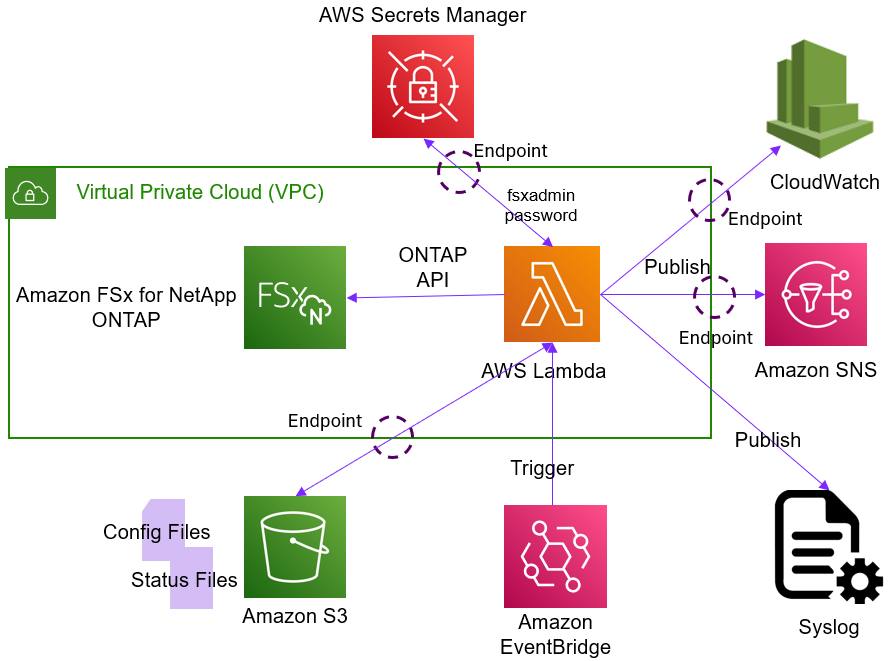

# FSx for ONTAP Alerting

## Introduction
This program is used to monitor various services of an AWS FSx for NetApp ONTAP file system and alert you if anything
is outside of the specified conditions. It uses the ONTAP APIs to obtain the required information to
determine if any of the conditions have been met.
If they have, then the program will send an SNS message to the specified SNS topic. It can also send
a syslog message, a webhook, as well as store the event information into a CloudWatch Log Stream.
The program takes measures to ensure it doesn't send multiple messages for the same event.

Here is this list of services that this program can monitor:
- If the file system is available.
- If the underlying Data ONTAP version has changed.
- If the file system is running off its partner node (i.e. is running in failover mode).
- If any of the network interfaces are down.
- Any EMS message. Filtering is provided to allow you to only be alerted on the EMS messages you care about.
- If any of the vservers are down.
- If any of the protocol (NFS & CIFS) services within a vserver are down.
- If a SnapMirror relationship hasn't been updated within either a specified amount of time or as a percentage of time since its last scheduled update.
- If a SnapMirror update has stalled.
- If a SnapMirror relationship is in a "non-healthy" state.
- If the aggregate is over a certain percentage full. You can set two thresholds (Warning and Critical).
- If a volume is over a certain percentage full. You can set two thresholds (Warning and Critical).
- If a volume is using more than a specified percentage of its inodes. You can set two thresholds (Warning and Critical).
- If a volume if offline.
- If any snapshots are older than a specified age.
- If any quotas values have been breached. You can be alerted on both soft and hard limits.

## Architecture
This solution is made up of two main components: the monitoring program and the controller. The monitoring
program is used to get the information from the FSxN(s) and sends any alerts to the various destinations. The
controller is used to invoke the monitoring program on a regular basis. It is done this way
so you can monitor multiple FSxN file systems with just these two components.

When the controller invokes the monitoring program it will send it the hostname (or IP address)
of the FSxN file system to monitor, as well as any other specific configuration parameters for the
particular FSxN file system that it will need to operate (e.g. the AWS Secrets Manager secret
to use, the targets to send alerts to, etc.)

Once the monitoring program has been invoked it will use the ONTAP APIs to obtain the required information 
from the FSxN file system. It will compare this information against the conditions that have been
specified in the conditions file (more information about the conditions file can be found in
the [Matching Conditions File](#matching-conditions-file) below). If any conditions have been
met it will send an alert to any of the specified targets (SNS Topic, syslog server, webhook endpoint,
CloudWatch Log Stream). The program stores all the conditions that are currently being met in an object in an
S3 bucket so it can ensure that it doesn't send duplicate messages for the same event.
The conditions file is also kept in the S3 bucket for easy access.

Since the monitoring program has to be able to communicate with
the FSxN file system management endpoint it must run within a VPC that has
connectivity to the FSxN file system. This requires special considerations for
a Lambda function, both how it is deployed, and how it is able to access AWS services. You can read more about
that in the [Create Any Needed AWS Service Endpoints](#create-any-needed-aws-service-endpoints) section below.

Here is a graphical representation of the architecture:



Note that as part of this solution CloudWatch alarms will be created to monitor the
health of the Lambda functions and alert you if either of them fails. It is highly recommended
that you don't disable them.

## Prerequisites
- One, or more, FSx for NetApp ONTAP file system you want to monitor.
- An S3 bucket to store the configuration and event status files, as well as the Lambda layer zip file.
    - **IMPORTANT** You must download the [Lambda layer zip file](https://raw.githubusercontent.com/NetApp/FSx-ONTAP-monitoring/main/FSx_Alerting/FSx_ONTAP_Alerting/lambda_layer.zip) from this repo and upload it to the S3 bucket. Be sure to preserve the name `lambda_layer.zip`. It contains some of the utilities that monitoring program depends on.
- The security group associated with the FSx for ONTAP file system must allow inbound traffic from the monitoring Lambda function over TCP port 443. It can either allow port 443 for all the possible IP addresses associated with the subnet you plan to deploy it in. Or, after the solution has been deployed, you can get the security group that was assigned to the monitoring Lambda function and allow port 443 from that security group.
- An SNS topic to send the alerts to.
- An AWS Secrets Manager secret(s) that holds the FSx for ONTAP file system credentials. There should be two keys in each secret, one for the username and one for the password.
- Create an object (file) within the S3 bucket that contains the list of FSxNs you want to monitor. The format of the file is listed in the [FSxN List File](#create-fsxn-list-file) section below.
- Optionally:
    - A CloudWatch Log Group to store events.
    - A syslog server to receive event messages.

## Installation
There are three ways to install this program. You can either perform all the steps shown in the
[Manual Installation](#manual-installation) section below, run the [CloudFormation template](cloudformation.yaml)
that is provided in this repository, or deploy using Terraform using the Terraform configuration files found in
the [terraform](terraform) directory. The manual installation is more involved, but it gives you
most control and allows you to make changes to settings that aren't available with the other methods.
The CloudFormation and Terraform are easier to use since you only need to provide a few parameters.

### Installation using the CloudFormation template
The CloudFormation template will do the following:
- Create a role for the Monitoring Lambda functions to use. The permissions will be the same as what
    is outlined in the [Create an AWS role for the Monitoring program](#create-an-aws-role-for-the-monitoring-program) section below.
    **NOTE:** You can provide the ARN of an existing role to use instead of having it create a new one.
- Create a role for the Controller Lambda functions to use. The permissions will be the same as what
    is outlined in the [Create an AWS role for the Controller program](#create-an-aws-role-for-the-controller-program) section below.
    **NOTE:** You can provide the ARN of an existing role to use instead of having it create a new one.
- Create two Lambda functions with the Python code provided in this repository.
- Create an EventBridge rule to trigger the controller Lambda function. By default, it will trigger
    it to run every 15 minutes, although there is a parameter that will allow you to set it to whatever interval you want.
- Optionally create a CloudWatch alarm for each of the Lambda function that will alert you if either of them fails to run properly.
    - Optionally create a Lambda function to send the CloudWatch alarm alert to an SNS topic. This is only needed if the SNS topic resides in another region since CloudWatch doesn't support doing that natively.
    - Optionally Create a role for the CloudWatch alarm so it can invoke above mentioned Lambda function. **NOTE:** You can provide the ARN of an existing role to use instead of having it create a new one. The only permission in this role is to allow it to invoke the Lambda function created above.
- Optionally create a VPC Endpoints for the SNS, Secrets Manager, CloudWatch and/or S3 AWS services.

To install the program using the CloudFormation template, you will need to do the following:
1. Ensure you have satisfied all the prerequisites listed in the [Prerequisites](#prerequisites) section above.
2. Download the CloudFormation template from this repository by right-clicking on [cloudformation.yaml](https://raw.githubusercontent.com/NetApp/FSx-ONTAP-monitoring/main/FSx_Alerting/FSx_ONTAP_Alerting/cloudformation.yaml) and selecting "Save Link as." If that doesn't work, you click on
    the [cloudformation.yaml](./cloudformation.yaml) file in the repository, then click on
    the download icon next to the "Raw" button at the top right of the page. That should
    cause your browser to download the file to your local computer.
3. Go to the [CloudFormation service in the AWS console](https://us-west-2.console.aws.amazon.com/cloudformation/) and click on "Create stack (with new resources)".
    - Make sure the correct region is selected in the top right corner of the page.
4. Choose the "Upload a template file" option and select the CloudFormation template you downloaded in step 1.
5. This should bring up a new window with several parameters to provide values to. Most have
    defaults, but some do require values to be provided. See the [Configuration Parameters](#configuration-parameters) section below for what each parameter is for.
6. Once you have provided all the parameters, click on the "Next" button. This will bring you to a page where you can
    provide tags for the stack. Any tags specified here will be applied to all resources that are created that
    support tags. Tags are optional and can be left blank. There are other configuration parameters you can
    change here, but typically you can leave them as defaults. Click on the "Next" button.
7. The final page will allow you to review all configuration parameters you provided.
    If everything looks good, click on the "Create stack" button.

### Installation using Terraform
Deploying with Terraform will do the following:
- Create a role for the Monitoring Lambda functions to use. The permissions will be the same as what
    is outlined in the [Create an AWS role for the Monitoring program](#create-an-aws-role-for-the-monitoring-program) section below.
    **NOTE:** You can provide the ARN of an existing role to use instead of having it create a new one.
- Create a role for the Controller Lambda functions to use. The permissions will be the same as what
    is outlined in the [Create an AWS role for the Controller program](#create-an-aws-role-for-the-controller-program) section below.
    **NOTE:** You can provide the ARN of an existing role to use instead of having it create a new one.
- Create two Lambda functions with the Python code provided in this repository.
- Create an EventBridge rule to trigger the controller Lambda function. By default, it will trigger
    it to run every 15 minutes, although there is a parameter that will allow you to set it to whatever interval you want.
- Optionally create a CloudWatch alarm for each of the Lambda function that will alert you if either of them fails to run properly.
    - Optionally create a Lambda function to send the CloudWatch alarm alert to an SNS topic. This is only needed if the SNS topic resides in another region since CloudWatch doesn't support doing that natively.
    - Optionally Create a role for the CloudWatch alarm so it can invoke above mentioned Lambda function. **NOTE:** You can provide the ARN of an existing role to use instead of having it create a new one. The only permission in this role is to allow it to invoke the Lambda function created above.
- Optionally create a VPC Endpoints for the SNS, Secrets Manager, CloudWatch and/or S3 AWS services.

To install the program using Terraform, you will need to do the following:
1. Ensure you have satisfied all the prerequisites listed in the [Prerequisites](#prerequisites) section above.
1. Copy all the files in this folder to your local machine.
1. Change into the `terraform` directory. Note that the Terraform configuration files are setup expecting the source files to the Lambda functions in the folder above it. If you need to change the location of the source files, you'll need to update the Terraform configuration files accordingly.
1. Copy the `terraform.tfvars.template` to `terraform.tfvars` and update the values in that file to match your environment. The `terraform.tfvars.template` file only has the required parameters in it. To see a complete list of variables refer to either the `vars.tf` file, or the [Configuration Parameters](#configuration-parameters) section list below.
1. Run `terraform init` to initialize the Terraform working directory.
1. Run `terraform apply` to apply the Terraform configuration and create the necessary resources in your AWS account.

### Configuration Parameters
|Parameter Name |Notes|
|---|---|
|Stackname\*|The name you want to assign to the CloudFormation stack. Note that this name is used as a base name for some of the resources it creates, so please keep it **under 25 characters**.|
|Region\*\*|The AWS region where you want to deploy the program.|
|S3BucketName|The name of the S3 bucket where you want the program to store event information. It should also have a copy of the `lambda_layer.zip` file. **NOTE** This bucket must be in the same region where this CloudFormation stack is being created.|
|FSxNListFilename|The name of the file (S3 object) within the S3 bucket that contains a list of FSxN file systems to monitor. The format of this file is specified in the [Create FSxN List File](#create-fsxn-list-file) section below.|
|SubnetIds|The subnet IDs that the monitoring Lambda function will run from. They must have connectivity to the FSxN file system management endpoints that you wish to monitor. It is recommended to select at least two.|
|SecurityGroupIds|The security group IDs that the monitoring Lambda function will be attached to. The security group must allow outbound traffic over port 443 to the SNS, Secrets Manager, CloudWatch and S3 AWS service endpoints, as well as the FSxN file systems you want to monitor.|
|SnsTopicArn|The ARN of the SNS topic you want the program to publish alert messages to.|
|SecretArnPattern|The ARN pattern of the SecretsManager secrets that holds the FSxN file system credentials for all the FSxNs you want to monitor.|
|CheckInterval|The interval, in minutes, that the EventBridge schedule will trigger the controller Lambda function. The default is 15 minutes.|
|CreateCloudWatchAlarm|Set to "true" if you want to create a CloudWatch alarm that will alert you if the either of the Lambda function fails. **NOTE:** If the SNS topic is in another region, be sure to enable ImplementWatchdogAsLambda.|
|ImplementWatchdogAsLambda|If set to "true" a Lambda function will be created that will allow the CloudWatch alarm to publish an alert to an SNS topic in another region. Only necessary if the SNS topic is in another region since CloudWatch cannot send alerts across regions.|
|WatchdogRoleArn|The ARN of the role assigned to the Lambda function that the watchdog CloudWatch alarm will use to publish SNS alerts with. The only required permission is to publish to the SNS topic listed above, although highly recommended that you also add the AWS managed "AWSLambdaBasicExecutionRole" policy that allows the Lambda function to create and write to a CloudWatch log stream so it can provide diagnostic output of something goes wrong. Only required if creating a CloudWatch alert, implemented as a Lambda function, and you want to provide your own role. If left blank a role will be created for you if needed.|
|ControllerRoleArn|The ARN of the role that the controller Lambda function will use. This role must have the permissions listed in the [Create an AWS Role for the Controller program](#create-an-aws-role-for-the-controller-program) section below. If left blank a role will be created for you.|
|MonitoringRoleArn|The ARN of the role that the monitoring Lambda function will use. This role must have the permissions listed in the [Create an AWS Role for the Monitoring program](#create-an-aws-role-for-the-monitoring-program) section below. If left blank a role will be created for you.|
|lambdaLayerArn|The ARN of the Lambda Layer to use for the Lambda function. This is only needed if you want to use an existing Lambda layer, typically from a previous installation of this program. If no ARN is provided, a Lambda Layer will be created for you from the lambda\_layer.zip found in your S3 bucket.|
|maxRunTime|The maximum amount of time, in seconds, that the monitoring Lambda function is allowed to run. The default is 60 seconds. You might have to increase this value if you have a lot of components in your FSxN file system. However, if you have to raise it to more than a couple minutes and the function still times out, then it could be an issue with the endpoint causing the calls to the AWS services to hang. See the [Create Any Needed AWS Service Endpoints](#create-any-needed-aws-service-endpoints) section below for more information.|
|memorySize|The amount of memory, in MB, to assign to the Lambda function. The default is 128 MB. You might have to increase this value if you have a lot of components in your FSxN file system.|
|CreateSecretsManagerEndpoint|Set to "true" if you want to create a Secrets Manager endpoint. **NOTE:** If a SecretsManager Endpoint already exist for the specified Subnet the endpoint creation will fail, causing the entire CloudFormation stack to fail. Please read the [Create Any Needed AWS Service Endpoints](#create-any-needed-aws-service-endpoints) for more information.|
|CreateSNSEndpoint|Set to "true" if you want to create an SNS endpoint. **NOTE:** If a SNS Endpoint already exist for the specified Subnet the endpoint creation will fail, causing the entire CloudFormation stack to fail. Please read the [Create Any Needed AWS Service Endpoints](#create-any-needed-aws-service-endpoints) for more information.|
|CreateCWEndpoint|Set to "true" if you want to create a CloudWatch endpoint. **NOTE:** If a CloudWatch Endpoint already exist for the specified Subnet the endpoint creation will fail, causing the entire CloudFormation stack to fail. Please read the [Create Any Needed AWS Service Endpoints](#create-any-needed-aws-service-endpoints) for more information.|
|CreateS3Endpoint|Set to "true" if you want to create an S3 endpoint. **NOTE:** If a S3 Gateway Endpoint already exist for the specified VPC the endpoint creation will fail, causing the entire CloudFormation stack to fail. Note that this will be a "Gateway" type endpoint, since they are free to use. Please read the [Create Any Needed AWS Service Endpoints](#create-any-needed-aws-service-endpoints) for more information.|
|RoutetableIds|The route table IDs to update to use the S3 endpoint. Since the S3 endpoint is of type `Gateway` route tables have to be updated to use it. This parameter is only needed if you are creating an S3 endpoint.|
|VpcId|The ID of a VPC where the subnets provided above are located. Required if you are creating an endpoint, not needed otherwise.|
|EndpointSecurityGroupIds|The security group IDs that the endpoint will be attached to. The security group must allow traffic over TCP port 443 from the Lambda function. This is required if you are creating an Lambda, CloudWatch or SecretsManager endpoint.|

\* - Only required if you are deploying using the CloudFormation template.

\*\* - Only required if you are deploying using Terraform.

The remaining parameters are used to create the matching conditions configuration file, which specify when the program will send an alert.
You can read more about it in the [Matching Conditions File](#matching-conditions-file) section below. All these parameters have reasonable default values
so you probably won't have to change any of them. Note that if you enable EMS alerts, then the default rule will
alert on all EMS messages that have a severity of `Error`, `Alert` or `Emergency`. You can change the
matching conditions at any time by updating the matching conditions file that is created in the S3 bucket.
The default name of the conditions file will be `<OntapAdminServer>-conditions` where `<OntapAdminServer>` is the value you
set for the OntapAdminServer parameter in the FSxNList file.


### Post Installation Checks
After the stack has been created, first check the status of the controller Lambda function to make sure it is
not in an error state. To find the controller Lambda function go to the Resources tab of the CloudFormation
stack and click on the "Physical ID" of the "ControllerLambdaFunction." This should bring you to the Lambda service in the AWS
console. Once there, click on the "Monitor" tab to see if the function has been invoked. Note that it will take
at least the configured iteration time before the function is invoked for the first time. Locate the
"Error count and success rate(%)" chart, which is usually found at the top right corner of the "Monitor" dashboard.
After  the "CheckInterval" number of minutes there should be at least one dot on that chart.
Hover your mouse over the dot and you should see the "success rate" and "number of errors."
The success rate should be 100% and the number of errors should be 0. If it is not, then scroll up a little bit and
click on "View CloudWatch Logs" link. Once on this page, click on the first LogStream and review any output.
If there are any errors, they will be displayed there. If you can't figure out what is causing an error,
please create an issue on the [Issues](https://github.com/NetApp/FSx-ONTAP-monitoring/issues) section
in this repository and someone will help you.

After you have checked the controller Lambda function, check the monitoring Lambda function the same way.

### Deploying the CloudFormation stack via the command line
If you want to deploy this program from the command line, you can use the [deployStack](deployStack) script
found in this repository. It takes various options to set the required parameters in the
stack. If you run the script without any parameters, it will display the usage information.

---

### Manual Installation
If you want more control over the installation then you can install it manually by following the steps below. Note that these
instructions assume you have familiarity with how to create the various AWS service mentioned below. If you do not,
the recommended course of action is to use the CloudFormation method of deploying the program. Then, if you need to change things, 
you can make the required modifications using the information found below.

#### Create an AWS Role for the Monitoring program
The program doesn't need many AWS permissions. It just needs to be able to read the FSxN file system credentials stored in a Secrets Manager secret,
read and write objects in an s3 bucket, be able to publish SNS messages, and optionally create CloudWatch log Streams and put events.
Below is the specific list of permissions needed.

| Permission                    | Minimal Resources | Reason     |
|:------------------------------|:-----------------:|:----------------|
|secretsmanager:GetSecretValue  | An ARN pattern to the secrets that hold the credentials to the FSxNs you plan to monitor as well as Webhook authentication secret if used. | To be able to retrieve the FSxN administrator and optionally webhook credentials.|
|sns:Publish                    | The ARN to the SNS topic you wish to publish to. | To allow it to send messages (alerts) via SNS.|
|s3:PutObject                   | The ARN to the S3 bucket | So it can store its state information in various s3 objects.|
|s3:GetObject                   | The ARN to the S3 bucket | So it can retrieve previous state information, as well as configuration files, from various s3 objects. |
|s3:ListBucket                  | The ARN to the S3 bucket | So it can detect if an object exist or not. |
|logs:CreateLogStream           | The ARN to the CloudWatch LogStream where you want to store events | If you want the program to send its logs to CloudWatch, it needs to be able to create a log stream. |
|logs:PutLogEvents              | The ARN to the CloudWatch LogStream where you want to store events | If you want the program to send its logs to CloudWatch, it needs to be able to put log events into the log stream. |
|logs:DescribeLogStreams        | The ARN to the CloudWatch LogStream where you want to store events | If you want the program to send its logs to CloudWatch, it needs to be able to see if a log stream already exists before attempting to send events to it. |
|ec2:CreateNetworkInterface     | \* | Since the program runs as a Lambda function within your VPC, it needs to be able to create a network interface in your VPC. You can read more about that [here](https://docs.aws.amazon.com/lambda/latest/dg/configuration-vpc.html). |
|ec2:DescribeSubnets          | \* | So it can get information about the subnets it is running in. |
|ec2:AssignPrivateIpAddresses | \* | So it can assign a private IP address to the network interface it created. |
|ec2:UnassignPrivateIpAddresses | \* | So it can unassign the private IP address from the network interface when it is not needed anymore. |
|ec2:DeleteNetworkInterface     | \* | Since it created a network interface, it needs to be able to delete it when not needed anymore. If you want to strict the scope of this permission, you can add a condition that it has to be within the same subnet.|
|ec2:DescribeNetworkInterfaces  | \* | So it can check to see if a network interface already exists. |

:bulb: **Tip** Instead of adding the last six `ec2` permissions, you can just assign the AWS managed policy called `AWSLambdaVPCAccessExecutionRole` to the role. It also has the required permission that allow it to write diagnostic logs to CloudWatch which will be very beneficial if something goes wrong.

#### Create an AWS Role for the Controller program
The controller also doesn't need many AWS permissions. It just needs to be able to invoke the monitoring Lambda function
and send SNS messages if the monitoring function fails (only if using synchronous invocation).
| Permission                    | Minimal Resources | Reason     |
|:------------------------------|:----------------|:--|
|lambda:InvokeFunction          | The ARN to the Monitoring Lambda function. | To be able to invoke the monitoring Lambda function.|
|sns:Publish                    | The ARN to the SNS topic you wish to publish alerts to | To allow it to send messages (alerts) via SNS if it is unable to invoke the monitoring function.|
|s3:GetObject                   | The ARN to the S3 bucket | So it can retrieve FSxN List file. |
|s3:ListBucket                  | The ARN to the S3 bucket | So it can detect if an object exist or not. |

:bulb: **Tip** To allow the Lambda function to write logs to CloudWatch, you can also assign the AWS managed policy called `AWSLambdaBasicExecutionRole` to the role.

#### Create an S3 Bucket
The first use of the s3 bucket will be to store the Lambda layer zip file. This is required to include some dependencies that
aren't included in the AWS Lambda environment. Currently the only dependency in the zip file is [cronsim](https://pypi.org/project/cronsim/).
This is used to interpret the SnapMirror schedules to be able to report on lag issues. You can download the zip file from this repository by clicking on
the [lambda_layer.zip](https://raw.githubusercontent.com/NetApp/FSx-ONTAP-monitoring/main/FSx_Alerting/FSx_ONTAP_Alerting/lambda_layer.zip) link.
You will refer to this file, and bucket, when you create the Lambda function.

Another use of the s3 bucket is to store events that have already been reported on so they can be compared against
to ensure program does not send multiple messages for the same event.
Note that it doesn't keep every event indefinitely, it only stores them while the condition is true. So, say for
example it sends an alert for a SnapMirror relationship that has a lag time that is too long. It will
send the alert and store the event. Once a successful SnapMirror synchronization has happened, the event will be removed
from the s3 object allowing for a new event to be created and alerted on. If you want to keep the event information
longer than that, please configure the program to store them in a CloudWatch log group.

This bucket is also used to store the Matching Condition file. You can read more about it in the [Matching Conditions File](#matching-conditions-file) below.

#### Create FSxN List File
The FSxN list file is used by the controller Lambda function to determine which FSxN file systems to monitor.
The format of the file is as follows:
```
<OntapAdminServer1>,<SecretArn1>,<param1>=<value1>,<param2>=<value2>,...
<OntapAdminServer2>,<SecretArn2>,<param1>=<value1>,<param2>=<value2>,...
...
```
The params can be any of the configuration parameters listed in the [Configuration Parameters](#configuration-parameters) section below.

#### Create an SNS Topic
Since the way this program sends alerts is via an SNS topic, you need to either create SNS topic, or use an
existing one.

#### Create a Secrets Manager Secret
Since the program issues API calls to the FSxN file systems it is going to monitor, it needs to be able to authenticate itself against them.
The safest way to provide credentials to the program is to use the AWS Secrets Manager service. Therefore, a Secrets Manager
secret must be created that contains the FSxN file system credentials. Either a separate secret for each FSxN, or if they all have a 
common user account and password, you can just use the same secret for all the FSxNs. The secret should contain two keys, one for the
username and one for the password.

The following command will create the secret for you. Just replace the values within the angle bracket `<`, `>` in the command with the appropriate strings.

```bash
aws secretsmanager create-secret --name <SecretName> --secret-string '{"username":"<FSxN_Username>","password":"<FSxN_Password>"}'
```

#### Create a CloudWatch Log Group
If you want the program to send its logs to CloudWatch, you will need to create a CloudWatch Log Group for it to
send its logs to. The program will create a new log stream within the log group for every day there is an event for a file system.
This step is optional if you don't want to send the logs to CloudWatch.

#### Create a Webhook payload configuration file
If you want the program to send alerts to a webhook endpoint, you can create a webhook payload configuration file
that specifies what should be send as the payload to the webhook. The format of the file is just plan text, however you can specify various
placeholders that will be replaced with actual values when the program sends the alert. You specify the placeholders by putting
them within curly braces `{}`. Here is a list of the available placeholders:

| Placeholder   | Description |
|:--------------|:------------|
| cluster\_name | The name of the FSxN cluster. |
| severity      | The severity of the event. |
| account\_id   | The AWS account ID set via the `awsAccountId` configuration parameter. |
| message       | The alert message. |
| message\_hash | A hash value that uniquely identifies the event. It is used to prevent duplicate alerts for the same event. |

If you don't provide a webhook payload configuration file, the program will use the following default payload:
```
{
    "INC__summary": "{severity}: FSx ONTAP Monitoring Services Alert for cluster {cluster_name}({account_id}).",
    "INC__manager": "FSxONTAP",
    "INC__severity": "3",
    "INC__identifier": "FSx ONTAP Monitoring Services alert for cluster {cluster_name}({account_id}) - {message_hash}",
    "INC__configurationItem": "{cluster_name}",
    "INC__fullMessageText": "{message}"
}
```

#### Create any needed AWS Service Endpoints
Since the monitoring Lambda function has to communicate with the FSxN withing your network, it will have to run within a VPC that has connectivity to the file
systems that you want to monitor. The monitoring Lambda function will also need access to the AWS service endpoints for the AWS services
that it uses (S3, SNS, CloudWatch, and SecretsManager). Access to these service endpoints is typically routed through the Internet,
however, because of the way AWS gives Lambda access to your subnet, it will not be allowed access to the Internet through an Internet Gateway
but it will allow access to the Internet through a NAT Gateway. Therefore, in order to allow access to these service endpoints you'll need to do one of the following:
- Deploy the Lambda function in a subnet that does **not** have an Internet Gateway, yet does have access
    to the Internet via a NAT Gateway or through a Transit Gateway.
- Deploy AWS Service endpoint for each of the AWS services that the Lambda function uses.

If you do need to deploy AWS service endpoints, keep the following in mind:
- Since VPC endpoints can't traverse AWS regions, all AWS assets (e.g. FSx for ONTAP file system, SecretsManager Secret, S3 bucket,
    SNS Topic and CloudWatch Log Group) must be in the same region as the VPC endpoint.
- For interface type endpoints, a network interface will be created in the VPC's subnet to allow access.
  To transparently access the service via the VPC endpoint, AWS will update its
  DNS entry for the service endpoint to point to the IP address of the VPC interface endpoint. This is only
  done if the "Private DNS names" option is enabled for the endpoint and "DNS Hostnames" is enabled for the VPC.
  If those two options aren't possible, and/or you aren't using AWS's DNS resolver, then you can set the
  following configuration parameters to override the hostname that the program
  uses for the specified AWS service endpoints. You will want to set the parameter to the DNS hostname for the
  endpoint. It typically starts with 'vpce'.

    |Configuration Parameter|AWS Service Name|
    |---|---|
    |snsEndPointHostname|Simple Notification Service (SNS)|
    |secretsManagerEndPointHostname|Secrets Manager|
    |cloudWatchEndPointHostname|CloudWatch Logs|
- For the S3 service endpoint it is best to deploy a "Gateway" type endpoint, since they are free. For the other
  services they will have to be of type "interface."
    - In order for a gateway type service endpoint to be accessible, a route has to be created in the
      subnet's routing table.

**NOTE:** One indication that the Lambda function doesn't have access to an AWS service endpoint is if the Lambda function
times out, even after adjusting the timeout to more than several minutes.

#### Create Lambda Functions
First create the monitoring Lambda function by going to the AWS Lambda service and creating a new function with:
- Give it a name. It can be anything, but a recommended name would be "Monitor-ONTAP-Service-Monitor"
- Set the runtime to be Python 3.11 or later.
- Assign it the role you created above.
- In the `Additional Configuration` section, set the VPC and subnets (at least two is recommended) that have access to the FSxN file system management endpoints you want to monitor.
- Assign it the security group that allows outbound traffic over TCP port 443 to the FSxN file system and AWS services endpoints.
- Click `Create Function`.

Once you have created the function you will be able to:
- Copy the Python code from the [monitor\_ontap\_service.py](monitor_ontap_services.py)
    file found in this repository into the code box and deploy it.
- Add the Lambda layer to the function. You do this by first creating a Lambda layer then adding it to your function.
    To create a Lambda layer go to the Lambda service page on the AWS console and click on the "Layers"
    tab under the "Additional resources" section. Then, click on the "Create layer" button.
    From there you'll need to provide a name for the layer, and the path to the
    [lambda_layer.zip](https://raw.githubusercontent.com/NetApp/FSx-ONTAP-monitoring/main/FSx_Alerting/FSx_ONTAP_Alerting/lambda_layer.zip)
    file that you should download from this repository. If you uploaded that into the S3 bucket you created above, then
    just provide the S3 path to the file. For example, `s3://<your-bucket-name>.s3.<s3_region>.awsamzoneaws.com/lambda_layer.zip`.
    Once you have the layer created, you can add it to your Lambda function by going to the Lambda
    function in the AWS console, and clicking on the `Code` tab and scrolling down to the Layers section.
    Click on the "Add a layer" button. From there you can select the layer you just created.
- Increase the total run time to at least 20 seconds. You might have to raise that if you have a lot
    of components in your FSxN file system. However, if you have to raise it to more than a couple minutes
    and the function still times out, then it could be an issue with the endpoint causing the calls to the
    AWS services to hang. See the [Create Any Needed AWS Service Endpoints](#create-any-needed-aws-service-endpoints) section above
    for more information.

Next, create the controller Lambda function by going to the AWS Lambda service and creating a new function with:
- Give it a name. It can be anything, but a recommended name would be "Monitor ONTAP Service Controller"
- Set the runtime to be Python 3.11 or later.
- Assign it the role you created above.
- Once you have created the function you should be able to go to the `Code` tab and copy the Python code from the
    [controller.py](controller.py) file found in this repository into the code box and deploy it.
- Go to the `Configuration` tab, and under the General Configuration sub tab set the timeout to be 10 seconds.
- Also under the `Configuration` tab, go to the `Environment variables` section.
    Add the following environment variables:
    - `s3BucketName` - Set to the name of the S3 bucket you created above.
    - `s3BucketRegion` - Set to the region where the S3 bucket is located.
    - `FSxNList` - Set to the name of the file (S3 object) within the S3 bucket that contains a list of FSxN file systems to monitor.
    - `MOSLambdaFunctionName` - Set to the name of the monitoring Lambda function you created above.
    - `snsTopicArn` - Set to the ARN of the SNS topic you created above.

#### Final Steps
1. Create the matching conditions file and upload it to the S3 bucket you created above. The format of the file is
described in the [Matching Conditions File](#matching-conditions-file) section below. By default the monitoring program
will look for the matching conditions file with a name of `<OntapAdminServer>-conditions` where `<OntapAdminServer>` is the value
you set for the OntapAdminServer parameter in the FSxNList file. You can change that by setting the
`conditionsFilename` configuration parameter in the FSxNList file to a different name. This allows you to have a different
matching conditions file for each FSxN file system or one common one for all, or most of them.

2. Test the controller Lambda function to ensure it can successfully invoke the monitoring Lambda function.
You can do this by going to the `Test` tab of the controller Lambda function and Clicking on the `Test` button.
You will see any error it has invoking the monitoring function on that page. Resolve any issues you find.

3. Test the Monitoring Lambda function to ensure it ran properly. Click on the "Monitor" tab of the monitoring
Lambda function and check the "Error count and success rate(%)" chart to ensure it it has zero errors. If there are
any errors, click on the "View CloudWatch Logs" link to see the error messages. If you can't figure out what is causing an error,
create an issue on the [Issues](https://github.com/NetApp/FSx-ONTAP-monitoring/issues) section
in this repository and someone will help you.

4. If anything is working as expected, set up an EventBridge Schedule rule to trigger the controller Lambda function
on a regular basis. A recommended interval is every 15 minutes.

5. It is recommended that you create a CloudWatch alarm to monitor both the controller and monitoring Lambda functions
so you'll know that they are running properly. You do that by going to the CloudWatch service in the AWS console and
clicking on the `Alarms` link in the left hand navigation pane. Then, clicking on the `Create alarm`
button. From there, click on the `Select metric` button. This will bring you to a page
where you can provide the Lambda function name created in the steps above. Once you
provide the name and hit `Return` it should present two boxes: "Lambda > By Resources" and "Lambda > By Function Name".
Click on the "Lambda > By Function Name" box. This will bring you to a page where you can select the metric you want to monitor.
In this case, you want to monitor the "Errors" metric so click on the box in front of the line with "Errors" as the metric name.
Click on the "Select metric" button. This will bring you to a page where you can set the conditions for the alarm.
The `Threshold Type` should be set to `Static` and the `Whenever Errors is...` set be set to `Greater`. Under the `than..` label
put `0.5` in the text box. This will set the alarm to trigger if there are any errors. Do this for both the controller and monitoring
Lambda functions.

### Configuration Parameters
Below is a list of parameters for the Monitoring Lambda function that are used to configure it. Some parameters are required to be set
while others are optional. Some of the optional ones are still required to be set to something but
if they are not, a usable default value will be assumed. Instead of passing all these parameters
via the FSxN\_List file, you can create a configuration file that contains the parameter assignments.
The assignments should be of the form "parameter=value". The default filename for the configuration
file is what you set the OntapAdminServer variable to plus the string "-config". If you want to use a different
filename, then set the configFilename parameter to the name of your choosing.

:warning: **NOTE:** Parameter names are case sensitive. 

|Parameter Name            | Required | Default Value | Description |
|:-------------------------|:--------:|:--------------|:------------|
| s3BucketName             | No       | The S3 bucket the controller uses | Set to the name of the S3 bucket where you want the program to store status files to. It will also read the matching configuration file from this bucket. |
| s3BucketRegion           | No       | The S3 bucket the controller uses | Set to the region where the S3 bucket is located. |
| OntapAdminServer         | Yes      | None          | Set to the DNS name, or IP address, of the ONTAP server you wish to monitor. This is the first parameter of the FSxN List file.|
| secretArn                | Yes      | None          | Set to the ARN of the secret within the AWS Secrets Manager that holds the FSxN credentials. This is the second parameter of the FSxN list file.|
| secretUsernameKey        | No       | username      | Set to the key name within the AWS Secrets Manager secret that holds the username portion of the FSxN credentials. |
| secretPasswordKey        | No       | password      | Set to the key name within the AWS Secrets Manager secret that holds the password portion of the FSxN credentials. |
| configFilename           | No       | OntapAdminServer + "-config" | Set to the filename (S3 object) that contains parameter assignments. It's okay if it doesn't exist, as long as there are environment variables for all the required parameters. |
| conditionsFilename       | No       | OntapAdminServer + "-conditions" | Set to the filename (S3 object) where you want the program to read the matching condition information from. |
| snsTopicArn              | Yes      | None          | Set to the ARN of the SNS topic you want the program to publish alert messages to. |
| cloudWatchLogGroupArn    | No       | None          | The ARN of **an existing** CloudWatch log group that the Lambda function will also send alerts to. If left blank, alerts will not be sent to CloudWatch.|
| syslogIP                 | No       | None          | Set to the IP address (or DNS hostname) of the syslog server where you want alerts sent to.|
| webhookEndpoint          | No       | None          | Set to the webhook endpoint URL you want the program to send alerts to. Note, you'll most likely need to update the `sendWebhook` function to format the message you want to send. If left blank messages will not be sent to a webhook. |
| webhookSeverity          | No       | INFO          | Sets a threshold for sending webhook messages. Valid values are: DEBUG, INFO, WARNING, ERROR, CRITICAL. Only events with a severity equal to or greater than this value will be sent to the webhook endpoint.|
| webhookConfigFilename    | No       | None          | Set to the filename (S3 object) where you define the payload to be sent to the webhook endpoint. The format of this file is described in the [Create a Webhook payload configuration file](#create-a-webhook-payload-configuration-file) section below. If left blank a default payload will be used.|
| webhookSecretARN         | No       | None          | Set to the ARN of the Secrets Manager secret that holds the credentials to be used to create a "basic" authentication header. If left blank no authentication header will be sent.|
| webhookSecretUsernameKey | No       | username      | Set to the key in the Secrets Manager secret that holds the username to be used to create a "basic" authentication header. If left blank and the webhookSecretARN is defined, "username" will be used.|
| webhookSecretPasswordKey | No       | password      | Set to the key in the Secrets Manager secret that holds the password to be used to create a "basic" authentication header. If left blank and the webhookSecretARN is defined, "password" will be used.|
| awsAccountId             | No       | None          | Set to the AWS account ID where the FSxN file system is located. This is purely for documentation purposes and serves no other purpose.|
| emsEventsFilename        | No       | OntapAdminServer + "-emsEvents" | Set to the filename (S3 object) where you want the program to store the EMS events that it has alerted on. This file will be created as necessary. |
| smEventsFilesname        | No       | OntapAdminServer + "-smEvents" | Set to the filename (S3 object) where you want the program to store the SnapMirror that it has alerted on. This file will be created as necessary.  |
| smRelationshipsFilename  | No       | OntapAdminServer + "-smRelationships" | Set to the filename (S3 object) where you want the program to store the SnapMirror relationships into. This file is used to track the number of bytes transferred so it can detect stalled SnapMirror updates. This file will be created as necessary. |
| storageEventsFilename    | No       | OntapAdminServer + "-storageEvents" | Set to the filename (S3 object) where you want the program to store the Storage Utilization events it has alerted on. This file will be created as necessary. |
| quotaEventsFilename      | No       | OntapAdminServer + "-quotaEvents" | Set to the filename (S3 object) where you want the program to store the Quota Utilization events it has alerted on. This file will be created as necessary. |
| vserverEventsFilename    | No       | OntapAdminServer + "-vserverEvents" | Set to the filename (S3 object) where you want the program to store the vserver events it has alerted on. This file will be created as necessary. |
| systemStatusFilename     | No       | OntapAdminServer + "-systemStatus" | Set to the filename (S3 object) where you want the program to store the overall system status information into. This file will be created as necessary. |
| snsEndPointHostname      | No       | None          | Set to the DNS hostname assigned to the SNS endpoint. Only needed if you had to create a VPC endpoint for the SNS service. | 
| secretsManagerEndPointHostname | No | None          | Set to the DNS hostname assigned to the SecretsManager endpoint created above. Only needed if you had to create a VPC endpoint for the Secrets Manager service.|
| cloudWatchLogsEndPointHostname | No | None          | Set to the DNS hostname assigned to the CloudWatch Logs endpoint created above. Only needed if you had to create a VPC endpoint for the Cloud Watch Logs service|

### Matching Conditions File
The Matching Conditions file allows you to specify which events you want to be alerted on. The format of the
file is JSON. JSON is basically a series of "key" : "value" pairs. Where the value can be object that also has
"key" : "value" pairs. For more information about the format of a JSON file, please refer to this [page](https://www.json.org/json-en.html).

The schema in the JSON file is made up of an array of objects, with a key name of "services". Each element of the "services" array
is an object with at least two keys. The first key is “name" which specifies the name of the service it is going to provide
matching conditions (rules) for. The second key is "rules" which is an array of objects that provide the specific
matching condition. Note that each service's rules has its own unique schema. The following is the definition of each service's schema.

#### Matching condition schema for System Health (systemHealth)
Each rule should be an object with one, or more, of the following keys:

|Key Name|Value Type|Notes|
|---|---|---|
|versionChange|Boolean (true, false)|If `true` the program will send an alert when the ONTAP version changes. If it is set to `false`, it will not report on version changes.|
|failover|Boolean|If 'true' the program will send an alert if the FSxN cluster is running on its standby node. If it is set to `false`, it will not report on failover status.|
|networkInterfaces|Boolean|If 'true' the program will send an alert if any of the network interfaces are down.  If it is set to `false`, it will not report on any network interfaces that are down.|

#### Matching condition schema for EMS Events (ems)
Each rule should be an object with three keys, with an optional 4th key:

|Key Name|Value Type|Notes|
|---|---|---|
|name|String|Regular expression that will match on an EMS event name.|
|message|String|Regular expression that will match on an EMS event message text.|
|severity|String|Regular expression that will match on the severity of the EMS event (debug, informational, notice, error, alert or emergency).|
|filter|String|If any event's message text match this regular express, then the EMS event will be skipped. Try to be as specific as possible to avoid unintentional filtering. This key is optional.|

Note that all values to each of the keys are used as a regular expressions against the associated EMS component. For
example, if you want to match on any event message text that starts with “snapmirror” then you would put `^snapmirror`.
The `^` character matches the beginning on the string. If you want to match on a specific EMS event name, then you should
anchor it with a regular express that starts with `^` for the beginning of the string and ends with `$` for the end of
the string. For example, `^arw.volume.state$`.  For a complete explanation of the regular expression syntax and special
characters, please refer to the [Python documentation](https://docs.python.org/3/library/re.html).

#### Matching condition schema for SnapMirror relationships (snapmirror)
Each rule should be an object with one, or more, of the following keys:

|Key Name|Value Type|Notes|
|---|---|---|
|maxLagTime|Integer|Specifies the maximum allowable time, in seconds, since the last successful SnapMirror update before an alert will be sent. Only used if maxLagTimePercent hasn't been provide, or if the SnapMirror relationship, and the policy it is assigned to, don't have a schedule associated with them. Best practice is to provide both maxLagTime and maxLagTimePercent to ensure all relationships get monitored, in case a schedule gets accidentally removed.|
|maxLagTimePercent|Integer|Specifies the maximum allowable time, in terms of percent of the amount of time since the last scheduled SnapMirror update, before an alert will be sent. Should be over 100. For example, a value of 200 means 2 times the period since the last scheduled update and if that was supposed to have happen 1 hour ago, it would alert if the relationship hasn't been updated within 2 hours.|
|stalledTransferSeconds|Integer|Specifies the minimum number of seconds that have to transpire before a SnapMirror transfer will be considered stalled.|
|healthy|Boolean|If `true` will alert with the relationship is healthy. If `false` will alert with the relationship is unhealthy.|

#### Matching condition schema for Storage Utilization (storage)
Each rule should be an object with one, or more, of the following keys:
|Key Name|Value Type|Notes|
|---|---|---|
|aggrWarnPercentUsed|Integer|Specifies the maximum allowable physical storage (aggregate) utilization (between 0 and 100) before an alert is sent.|
|aggrCriticalPercentUsed|Integer|Specifies the maximum allowable physical storage (aggregate) utilization (between 0 and 100) before an alert is sent.|
|volumeWarnPercentUsed|Integer|Specifies the maximum allowable volume utilization (between 0 and 100) before an alert is sent.|
|volumeCriticalPercentUsed|Integer|Specifies the maximum allowable volume utilization (between 0 and 100) before an alert is sent.|
|volumeWarnFilesPercentUsed|Integer|Specifies the maximum allowable volume files (inodes) utilization (between 0 and 100) before an alert is sent.|
|volumeCriticalFilesPercentUsed|Integer|Specifies the maximum allowable volume files (inodes) utilization (between 0 and 100) before an alert is sent.|
|offline|Boolean|If `true` will alert if the volume is offline.|
|oldSnapshot|Integer|Specifies the maximum allowable age, in days, before an alert is sent for a snapshot.|

#### Matching condition schema for Quota (quota)
Each rule should be an object with one, or more, of the following keys:

|Key Name|Value Type|Notes|
|---|---|---|
|maxHardQuotaSpacePercentUsed|Integer|Specifies the maximum allowable storage utilization (between 0 and 100) against the hard quota limit before an alert is sent.|
|maxSoftQuotaSpacePercentUsed|Integer|Specifies the maximum allowable storage utilization (between 0 and 100) against the soft quota limit before an alert is sent.|
|maxHardQuotaInodesPercentUsed|Integer|Specifies the maximum allowable inode utilization (between 0 and 100) against the hard quota limit before an alert is sent.|
|maxSoftQuotaInodesPercentUsed|Integer|Specifies the maximum allowable inode utilization (between 0 and 100) against the soft quota limit before an alert is sent.|

#### Matching condition schema for Vserver (vserver)
Each rule should be an object with one, or more, of the following keys:
|Key Name|Value Type|Notes|
|---|---|---|
|vserverState|Boolean|If `true` will alert if the vserver is not in `running` state.|
|nfsProtocolState|Boolean|If `true` will alert if the NFS protocol is not enabled on a vserver.|
|cifsProtocolState|Boolean|If `true` will alert if the CIFS protocol is enabled for a vserver but doesn't have an `online` status.|

#### Example Matching conditions file:
```json
{
  "services": [
    {
      "name": "systemHealth",
      "rules": [
        {
          "versionChange": true,
          "failover": true
        },
        {
          "networkInterfaces": true
        }
      ]
    },
    {
      "name": "ems",
      "rules": [
        {
          "name": "^passwd.changed$",
          "severity": "",
          "message": ""
        },
        {
          "name": "",
          "severity": "alert|emergency",
          "message": ""
        }
      ]
    },
    {
      "name": "snapmirror",
      "rules": [
        {
          "maxLagTime": 86400
          "maxLagTimePercent": 200
        },
        {
          "healthy": false
        },
        {
          "stalledTransferSeconds": 600
        }
      ]
    },
    {
      "name": "storage",
      "rules": [
        {
          "aggrWarnPercentUsed": 80,
          "aggrCriticalPercentUsed": 90
        },
        {
          "volumeWarnPercentUsed": 85,
          "volumeCriticalPercentUsed": 95
        },
        {
           "volumeWarnFilesPercentUsed": 90,
           "volumeCriticalFilesPercentUsed": 95
        },
        {
          "offline": true,
          "oldSnapshot": 90
        }
      ]
    },
    {
      "name": "quota",
      "rules": [
        {
          "maxHardQuotaSpacePercentUsed": 95,
          "maxSoftQuotaSpacePercentUsed": 100
        },
        {
          "maxHardQuotaInodesPercentUsed": 95,
          "maxSoftQuotaInodesPercentUsed": 100
        }
      ]
    }
  ]
}
```
In the above example, it will alert on:

- Any version change, including patch level, of the ONTAP O/S.
- If the system is running off of the standby node.
- Any network interfaces that are down. 
- Any EMS message that has an event name of “passwd.changed”.
- Any EMS message that has a severity of "alert" or “emergency”.
- Any SnapMirror relationship with a lag time more than 200% the amount of time since its last scheduled update, if it has a schedule associated with it.
    Otherwise, if the last successful update has been more than 86400 seconds (24 hours).
- Any SnapMirror relationship that has a non-healthy status.
- Any SnapMirror update that hasn't had any flow of data in 600 seconds (10 minutes).
- If the cluster aggregate is more than 80% full.
- If the cluster aggregate is more than 90% full.
- If any volume is more than 85% full.
- if any volume is more than 95% full.
- if any volume is using more than 90% of its inodes.
- if any volume is using more than 95% of its inodes.
- If any quota policies where the space utilization is more than 95% of the hard limit.
- If any quota policies where the space utilization is more than 100% of the soft limit.
- If any quota policies where the inode utilization is more than 95% of the hard limit.
- If any quota policies where the inode utilization is more than 100% of the soft limit.

A matching conditions file must be created and stored in the S3 bucket with the name given as the "conditionsFilename"
configuration variable. Feel free to use the example above as a starting point. Note that you should ensure it
is in valid JSON format, otherwise the program will fail to load the file. There are various programs and
websites that can validate a JSON file for you.

## Author Information

This repository is maintained by the contributors listed on [GitHub](https://github.com/NetApp/FSx-ONTAP-monitoring/graphs/contributors).

## License

Licensed under the Apache License, Version 2.0 (the "License").

You may obtain a copy of the License at [apache.org/licenses/LICENSE-2.0](http://www.apache.org/licenses/LICENSE-2.0).

Unless required by applicable law or agreed to in writing, software distributed under the License is distributed on an "AS IS" basis, without WARRANTIES or conditions of any kind, either express or implied.

See the License for the specific language governing permissions and limitations under the License.
