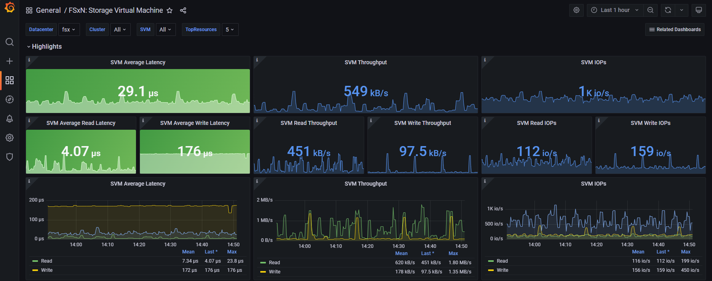
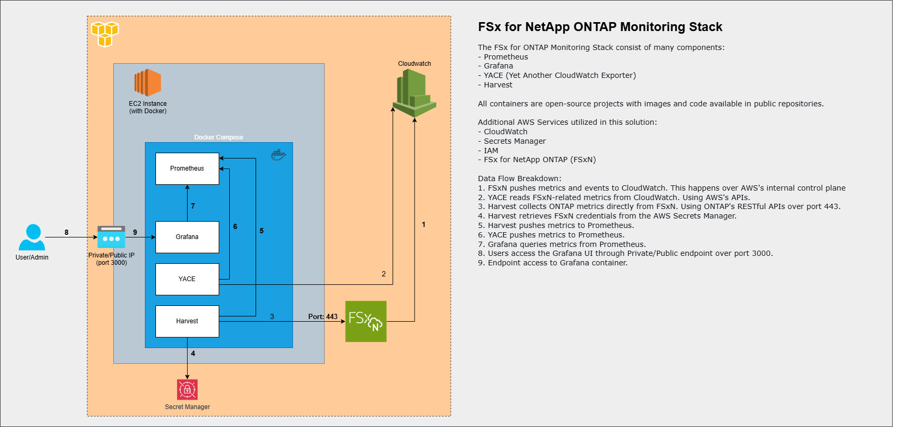

# Harvest/Grafana Deployment using AWS CloudFormation
This is the NetApp FSx for ONTAP deployment for monitoring FSx for ONTAP file systems with Grafana.  
It leverages NetApp Harvest and YACE (Yet Another CloudWatch Exporter) to retrieve FSx for Datax ONTAP and CloudWatch metrics.

YACE, or Yet Another CloudWatch Exporter, is a Prometheus exporter for AWS CloudWatch metrics. It is written in
Go and uses the official AWS SDK. YACE supports auto-discovery of resources via tags, structured logging,
filtering monitored resources via regex, and more. You can read more about YACE capabilities from its
[Documentation](https://github.com/prometheus-community/yet-another-cloudwatch-exporter).

Here are some screenshots of a couple of the dashboards that are included to visualize the metrics collected by Harvest and YACE.




## Prerequisites
- An FSx for ONTAP file system running in your AWS account.
- An AWS Secrets Manager secret containing the credentials to be used to retrieve the metrics from the FSx for ONTAP file system.
    - The secret **must** have a tag with a key of `fsxmonitoring` and a value of `true`.
    - The secret value should have the following key/value pairs:
        - `username`: `<username>`
        - `password`: `<your_password>`
- Optionally an AWS IAM role with the following permissions:
    |Permission|Minimal Resources|Description|
    |:---|:---:|:---|
    |`secretsmanager:GetSecretValue`|The ARNs to the secrets, or `*` and a condition to only allow access to secrets that have a tag with a key of `fsxmonitoring` and a value of `true`.|Allows Harvest to retrieve the credentials from the AWS Secrets Manager secret.|
    |`tag:GetResources`|`*`|Allows YACE to discover and get CloudWatch metrics of the FSxNs|
    |`cloudwatch:GetMetricData`|`*`|Allows YACE to discover and get CloudWatch metrics of the FSxNs|
    |`cloudwatch:GetMetricStatistics`|`*`|Allows YACE to discover and get CloudWatch metrics of the FSxNs|
    |`cloudwatch:ListMetrics`|`*`|Allows YACE to discover and get CloudWatch metrics of the FSxNs|

## Architectural Overview

This solution uses several components to collect and display all the pertinent metrics from your FSx for ONTAP file system.
Instead of trying to describe them in words, the following architectural diagram does a great job of showing the components and how they interact with each other:


## Deployment Overview

There are two methods to deploy this solution, either via the AWS CloudFormation template provided in this repo or manually.
The steps below are geared towards the CloudFormation deployment method. If you want to deploy manually,
please refer to these [Manual Deployment Instructions](README-Manual.md).

This deployment creates the following AWS resources:
- **EC2 Instance**: Runs Docker with a containerized versions of Harvest, YACE, Prometheus and Grafana.
    - **Harvest**: Collects ONTAP metrics.[Documentation](https://github.com/NetApp/harvest).
    - **Yet Another CloudWatch Exporter (YACE)**: Collects FSxN CloudWatch metrics.[Documentation](https://github.com/prometheus-community/yet-another-cloudwatch-exporter).
    - **Prometheus**: Stores the metrics.
    - **Grafana**: Visualizes the metrics.
- Optionally **IAM Role**: Provides the necessary permissions to the EC2 instance to access the FSx for ONTAP file system and AWS Secrets Manager secret. If not created, one will need to be provided.
- **EC2 Instance Profile**: Allows the EC2 instance to assume the IAM role created above or provided.

## Deployment Steps

1. **Download the AWS CloudFormation Template file**
   - Download the [harvest-grafana-cf-template.yaml](harvest-grafana-cf-template.yaml) file from this repo. Click on the download icon in the top right corner of the file view to download it to your local machine.

2. **Create the Stack**
   - Open the AWS console and go to the CloudFormation service page.
   - Choose **Create stack** and select **With new resources**.
   - Select **Choose an existing template** and **Upload a template file**.
   - Select the `harvest-grafana-cf-template.yaml` file you downloaded in the step above.
   - Click **Next**.

3. **Specify Stack Details**
   - **Parameters**: Review and modify the parameters as needed for your file system:
     - **InstanceType**: Select the instance type to run the Harvest+Grafana+Prometheus stack. You should allocate at least 2 vCPUs and 1GB of RAM for every 10 FSxN file systems you plan to monitor. The default is `t3.medium`.
     - **KeyPair**: Specify the AWS EC2 key pair to access the EC2 instance once it has been created.
     - **SecurityGroup**: Ensure inbound TCP ports 22, 3000 and optionally 9090 are open and outbound TCP port 443 to the FSxNs you plan to monitor is open. It will also need access to the Internet over TCP port 443 so it can download the container images.
     - **Subnet**: Specify a subnet that will have connectivity to all the FSxN file systems you plan to monitor.
     - **SubnetType**: Choose `public` or `private`. `Public` will allocated a public IP address to the EC2 instance.
     - **InstanceAmiId**: Specify the Amazon Linux 2023 AMI ID for the EC2 instance. The default is the latest version.
     - **RoleName**: If you want to specify your own IAM role for the EC2 instance with at least the permissions listed above, enter the name here. If you leave it blank, one will created with the necessary permissions for you.
     - **FSxEndPoint**: Specify the management endpoint IP address of one of your FSx file systems. You will be able to add additional FSx file systems later.
     - **SecretName**: Specify the AWS Secrets Manager secret name containing the credentials to use to retrieve the metrics from the FSx for ONTAP file system.
  - Click **Next**.

4. **Configure Stack Options**
   - You shouldn't have to change any options.
   - Select the check box to acknowledge that the template might create IAM resource. If you provided an IAM role in the previous step, one will not be created.
   - Click **Next**.

5. **Review and Create**
   - Review the stack details and confirm the settings.
   - Click **Submit**.

6. **Monitor Stack Creation**
   - Monitor the status of the stack in the AWS CloudFormation console. The status should change to `CREATE_COMPLETE` in about five minutes.

## Accessing Grafana

- After the deployment is complete, log in to the Grafana dashboard using your browser:
  - URL: `http://<EC2_instance_IP>:3000`
  - Default credentials:
    - Username: `admin`
    - Password: `admin`
  - **Note**: You will be prompted to change your password upon the first login, it is recommended to do so.

## Supported Dashboards

Amazon FSx for NetApp ONTAP exposes a different set of metrics than on-premises NetApp ONTAP. 
Therefore, only the following out-of-the-box Harvest dashboards tagged with `fsx` are currently supported for use with FSx for ONTAP. 
Some panels in these dashboards may be missing information that is not supported:

- **FSxN_Clusters**
- **FSxN_CW_Utilization**
- **FSxN_Data_protection**
- **FSxN_LUN**
- **FSxN_SVM**
- **FSxN_Volume**

---

## Update the FSx for NetApp ONTAP file systems you want to monitor

The way the monitoring system know which file systems to monitor is with a file of the name `input.txt`. This has the following format:

- One line per FSx for NetApp ONTAP file system you want to monitor.
- Blank lines and lines starting with `#` are ignored.
- Each line should contain the following comma-separated values:
    ```
    <filesystem_name>,<managment_ip>,<secret_ARN>,<region>
    ```
    Where:

        <filesystem_name>: The name of the FSx for NetApp ONTAP file system. **Cannot contain spaces**.
        <management_ip>: The management IP address of the FSx for NetApp ONTAP file system.
        <secret_ARN>: The ARN of the AWS Secrets Manager secret that contains the credentials to use.
        <region>: The AWS region where the FSx for NetApp ONTAP file system is located.

To add or remove FSxN resources, follow these steps:

1. **Log in via SSH to the EC2 instance**

2. **Move to the Harvest Directory**

    Navigate to the Harvest directory:
    ```bash
    cd /opt/harvest
    ```

3. **Update the input.txt file**

    - To add a system, edit the `input.txt` file to add the new AWS FSx for NetApp ONTAP information. Note you will need `root` privileges to edit the file so put `sudo` in front of your favorite editor. For example:
      ```bash
      sudo vi input.txt
      ```

    - To stop monitoring a system, edit the `input.txt` file and remove the line for the system you want to stop monitoring. Note that when you stop monitoring a system, its previous metrics will still be available in the Grafana dashboards until they "age out." No new data will be collected though.

4. **Run the update_cluster.sh script**
    - Run the `update_cluster.sh` script to update the Harvest configuration. You will need `root` privileges to run this script, so use `sudo`:
      ```bash
      sudo ./update_cluster.sh
      ```

---

## Author Information

This repository is maintained by the contributors listed on [GitHub](https://github.com/NetApp/FSx-ONTAP-monitoring/graphs/contributors).

## License

Licensed under the Apache License, Version 2.0 (the "License").

You may obtain a copy of the License at [apache.org/licenses/LICENSE-2.0](http://www.apache.org/licenses/LICENSE-2.0).

Unless required by applicable law or agreed to in writing, software distributed under the License is distributed on an _"AS IS"_ basis, without WARRANTIES or conditions of any kind, either express or implied.

See the License for the specific language governing permissions and limitations under the License.

© 2025 NetApp, Inc. All Rights Reserved.
